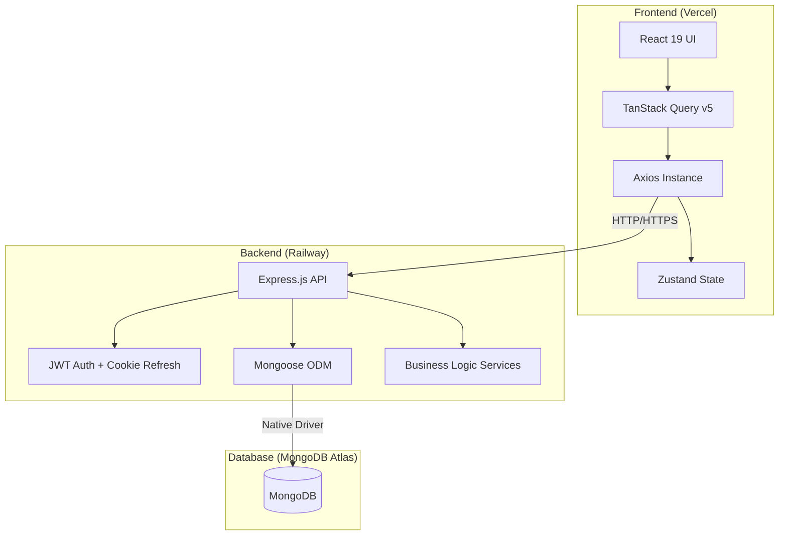

# 🏗 FlowForge: Technical Documentation & Project Overview

This document provides an exhaustive technical breakdown of the **FlowForge** project, covering architecture, directory structure, data flow, and implementation details for both the frontend and backend.

---

## 🗺 System Architecture

FlowForge is a full-stack SaaS platform built using a modern decoupled architecture:

---

## 🎨 Frontend (React + Vite)

### Core Technologies
- **React 19**: Latest concurrent features.
- **Tailwind CSS 4**: Next-gen styling with CSS-first configuration.
- **TanStack Query (React Query) v5**: Managed server state, caching, and optimistic updates.
- **Zustand**: Lightweight client-side state (Auth, UI preferences).
- **Framer Motion**: Premium animations and layout transitions.

### Directory Structure (`/src`)
- `app/`: Entry points, global providers, and the central `router.tsx`.
- `components/`:
    - `layout/`: structural wrappers (Navbar, Sidebar).
    - `shared/`: Generic components (Logo, ProtectedRoute).
    - `ui/`: Design system primitives (Button, Input, Modal, Skeleton).
- `features/`: Complex domain-specific logic.
    - `projects/`: Project management UI components.
- `hooks/`: Custom React hooks, primarily wrapping TanStack Query (e.g., `useProjects.ts`, `useAuth.ts`).
- `lib/`: Third-party configurations (Axios instance, Query Client).
- `pages/`: Page-level components organized by feature (Auth, Hub, Intake).
- `services/`: API caller classes/objects (AuthService, ProjectService, IntakeService).
- `store/`: Zustand store definitions.
- `types/`: Shared TypeScript interfaces and enums.
- `utils/`: Helper functions (class manipulation, formatting).

### Key Logic: The "Silent Refresh" Auth Flow
Located in `src/lib/axios.ts` and `src/app/AuthInitializer.tsx`:
1.  On app load, `AuthInitializer` calls `/auth/refresh` to check for an existing `httpOnly` cookie.
2.  Axios interceptors detect `401 Unauthorized` responses.
3.  If a `401` occurs, the request is queued, a refresh token call is made, and the queue is replayed with the new access token.

---

## ⚙️ Backend (Node.js + Express)

### Core Technologies
- **Node.js 22**: Using the latest LTS features.
- **Express.js**: Robust routing and middleware.
- **Mongoose**: MongoDB object modeling with strict typing.
- **TypeScript (tsc)**: Entire backend is written in strictly typed TS.

### Directory Structure (`/server/src`)
- `app.ts`: Express application setup (Middleware, CORS, Route mounting).
- `server.ts`: HTTP server entry point.
- `config/`: Environment variables and database connection logic.
- `controllers/`: Request/Response handlers. They interact with Services.
- `services/`: The "Brain" of the backend. Contains all business logic and DB queries.
- `models/`: Mongoose schemas (User, Project, IntakeBundle, etc.).
- `routes/`: API endpoint definitions (RESTful structure).
- `middleware/`: Auth guards (`auth.middleware.ts`), validation, and error handling.
- `utils/`: Standardized response helpers (`response.utils.ts`) and sanitization.

### Key Logic: The Intake Engine (Module 2)
The Intake Engine captures business workflows through a multi-step process:
1.  **Form Submission**: `POST /api/intake/:projectId/form` saves structured data (Clinic/School details).
2.  **Guided Screens**: `PATCH /api/intake/:projectId/screen/:number` saves freeform text describing the workflow.
3.  **Assembly**: `POST /api/intake/:projectId/assemble` runs a validator that checks word counts and keywords, then generates a unified `IntakeBundle` JSON.

---

## 🗄 Database (MongoDB)

### Primary Models
- **User**: Stores profile, credentials (hashed), and organization metadata.
- **Project**: Tracks project status (`INTAKE`, `SPEC_READY`, etc.), domain, and ownership.
- **IntakeBundle**: A rich document containing the raw and structured workflow data, along with AI-ready JSON blueprints.
- **IntakeQuestion**: Seed data for the dynamic intake forms.

---

## 🚀 Deployment & Infrastructure

### 1. Railway (Backend)
- Deployed via `server/Dockerfile`.
- Uses `railway.toml` to define the start command: `node dist/server.js`.
- Automatically triggers on `main` branch pushes.

### 2. Vercel (Frontend)
- Deployed as a Vite project.
- Configured via `vercel.json` for SPA routing (redirecting all routes to `index.html`).

### 3. CI/CD Patterns
- **Build Checks**: Both frontend and backend run `tsc --noEmit` to ensure type safety before deployment.
- **Environment Management**: Hardcoded production URLs in `axiosInstance` ensure the frontend always communicates with the live Railway API.

---

## 🛠 Development Workflow

1.  **Start Backend**: `cd server && npm run dev`
2.  **Start Frontend**: `npm run dev`
3.  **Database**: Connects to MongoDB Atlas (connection string in `.env`).

---

## 📝 Important Files at a Glance

| File | Purpose |
| :--- | :--- |
| `src/app/router.tsx` | Main application navigation logic. |
| `src/lib/axios.ts` | Centralized API client with auth interceptors. |
| `src/hooks/useProjects.ts` | React Query hooks for project CRUD operations. |
| `server/src/app.ts` | Global backend middleware and route registration. |
| `server/src/services/project.service.ts` | Core business logic for project management. |
| `server/src/models/IntakeBundle.model.ts` | The most complex data model in the system. |

---

*This documentation was last updated on May 11, 2026.*
